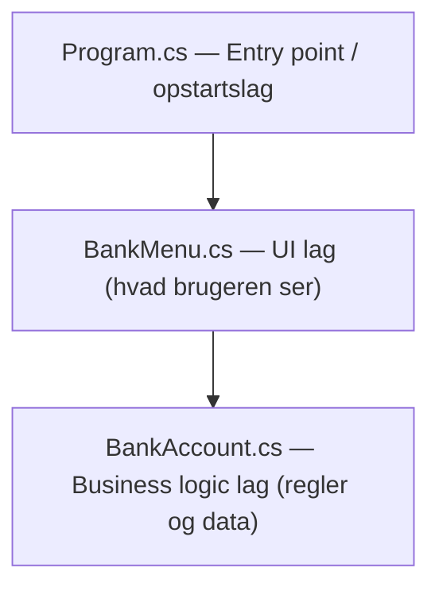
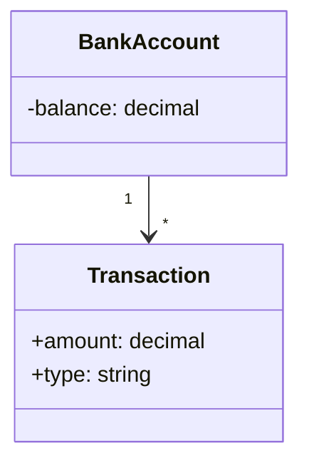
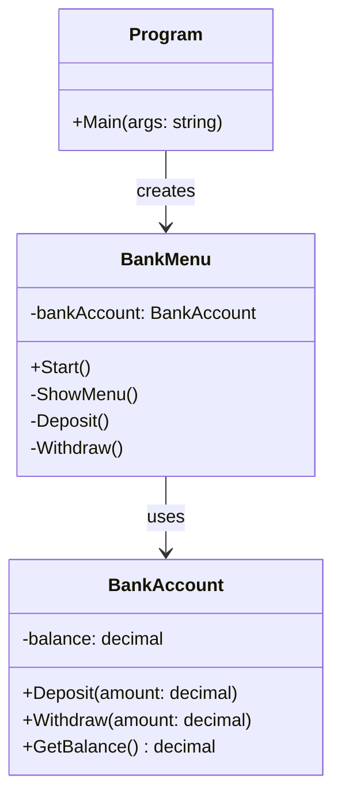
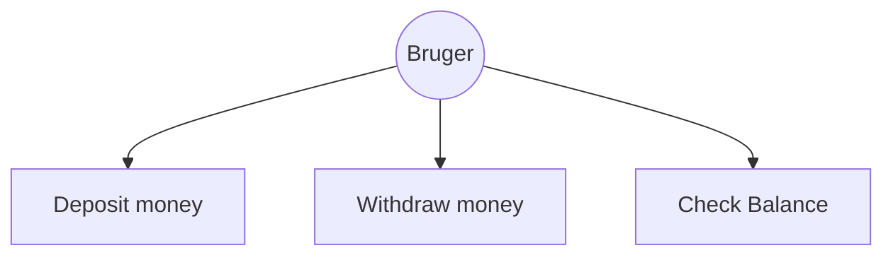
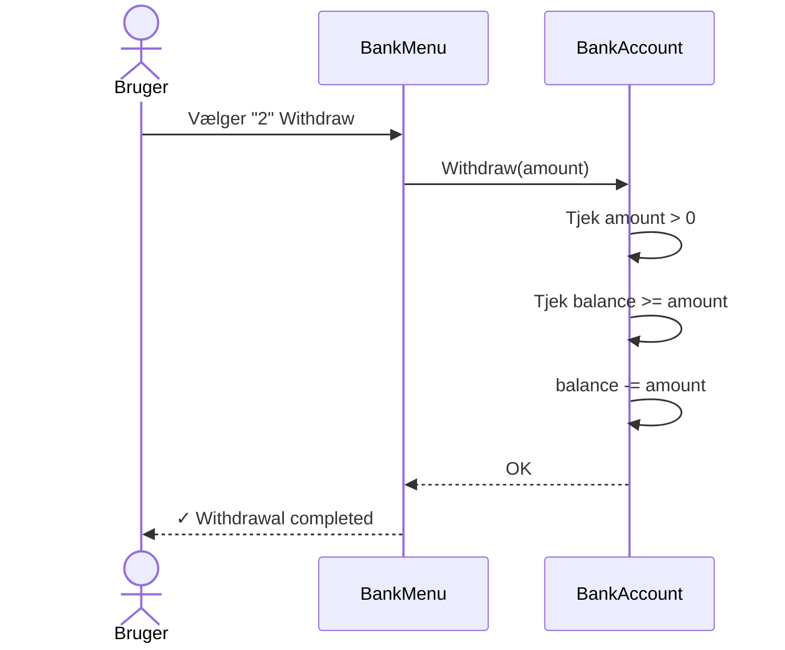
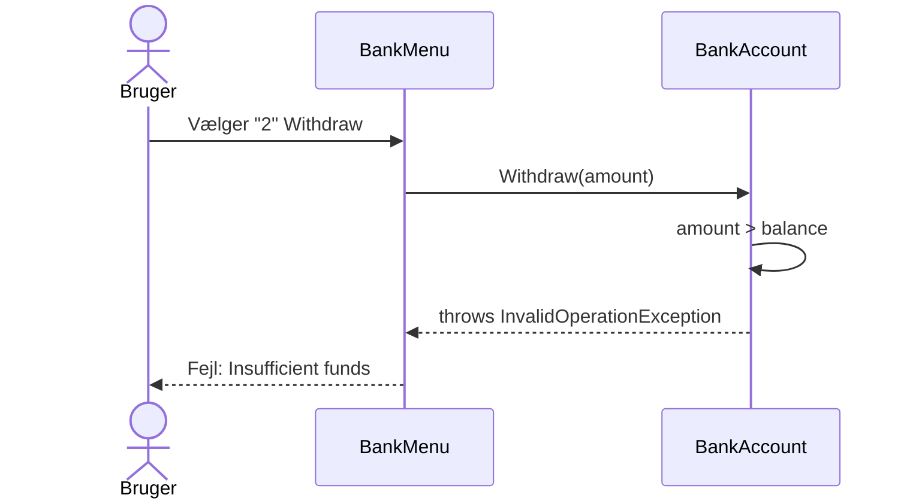

# 🏦 Bank System — Learning C#

Et simpelt konsolbaseret banksystem bygget i C# som en læringsopgave.
Projektet demonstrerer grundlæggende OOP principper, encapsulation og layered architecture.

---

## Hvad programmet kan
- Indsætte penge (Deposit)
- Hæve penge (Withdraw)
- Tjekke saldo (Check Balance)

## Teknologier
- C# / .NET
- Konsol applikation

---

## Principper

### Encapsulation
`balance` er `private` i `BankAccount` — ingen udefra kan ændre den direkte, kun via `Deposit()` og `Withdraw()`.

### Single Responsibility Principle (SRP)
Hver klasse har ét ansvarsområde:
- `BankAccount` — banklogik og validering
- `BankMenu` — UI og brugerinput
- `Program` — starter applikationen

### Separation of Concerns
Logik, UI og opstart er adskilt i hver sin klasse og blander sig ikke i hinandens arbejde.

### Object Oriented Programming (OOP)
Bruger klasser og objekter i stedet for at have alt i én lang `Main` metode.

### Defensive Programming
`decimal.TryParse` og `try/catch` sikrer at programmet ikke crasher ved ugyldigt input.

---

## Arkitektur

Koden følger en simpel **Layered Architecture** med 3 lag:

Hvert lag må kun tale med laget under sig:
- `Program` taler med `BankMenu`
- `BankMenu` taler med `BankAccount`
- `BankAccount` taler ikke med nogen — den passer sig selv

---

## Diagrammer

### Domæne Model

### Klasse Diagram

### Use Case Diagram

### Sekvens Diagram — Withdraw success

### Sekvens Diagram — Withdraw fejl

## Demo
https://github.com/user-attachments/assets/6b9b4574-a4c4-43e7-a56c-e6a83c9fc750

