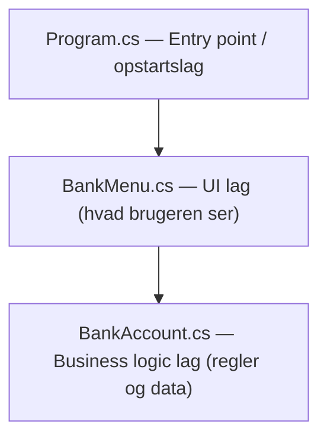
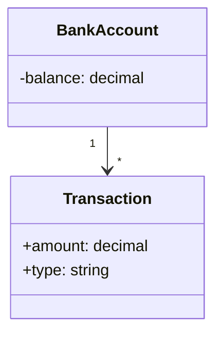
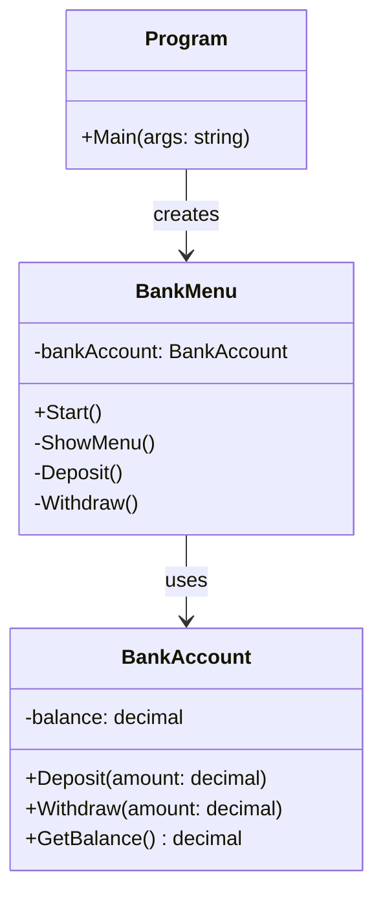
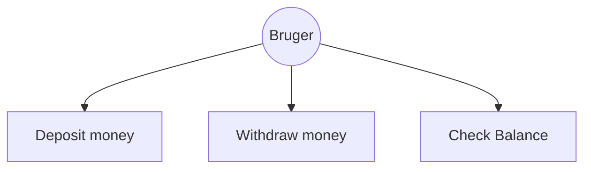
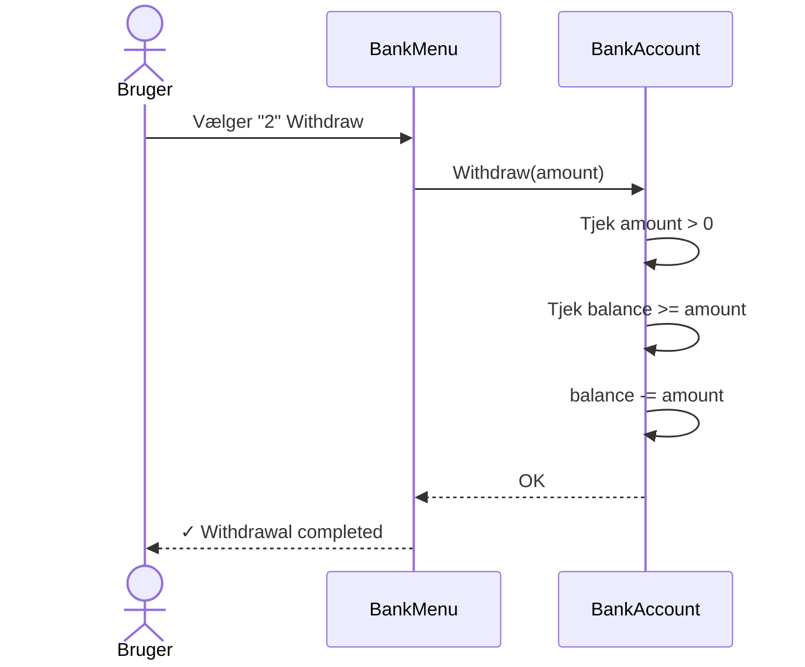
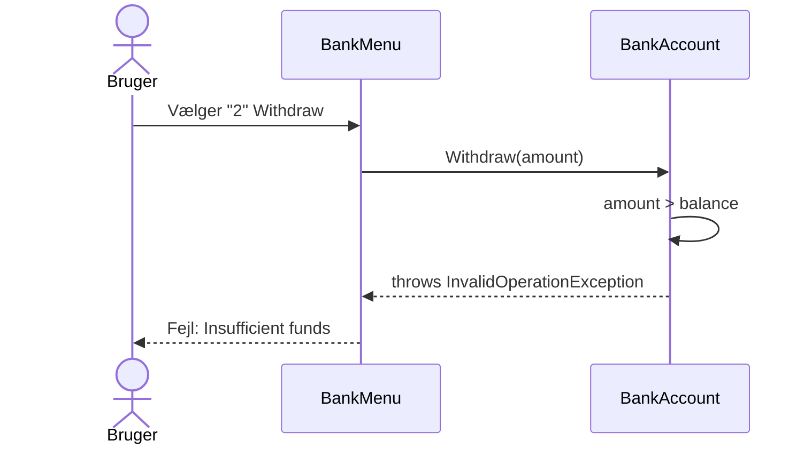

Koden opfylder flere principper:

ENCAPSULATION

balance er private i BankAccount — ingen udefra kan ændre den direkte, kun via Deposit() og Withdraw().

SINGLE RESPONSIBILITY PRINCIPLE (SRP)

Hver klasse har ét ansvarsområde:

SEPARATION OF CONCERNS

Relateret til SRP — logik, UI og opstart er adskilt i hver sin klasse og blander sig ikke i hinandens arbejde.

OBJECT ORIENTED PROGRAMMING (OOP)

Bruger klasser og objekter som new BankMenu() og new BankAccount() i stedet for at have alt i én lang Main metode.

DEFENSIVE PROGRAMMING

decimal.TryParse og try/catch sikrer at programmet ikke crasher ved ugyldigt input.

LAYERED ARCHITECTURE

(a foundational software design pattern)

Koden følger en simpel Layered Architecture (lagdelt arkitektur) med 3 lag:

BankAccount — håndterer banklogik og validering

BankMenu — håndterer UI og brugerinput

Program — starter applikationen

Program.cs      →    BankMenu.cs         →    BankAccount.cs
Starter app          UI og menu logik         Banklogik og validering

Arkitekturen:

Hvert lag må kun tale med laget under sig:

Program taler med BankMenu

BankMenu taler med BankAccount

BankAccount taler ikke med nogen — den passer sig selv

Hvad det betyder i praksis:

Hvis du vil lave en ny UI kan du bare udskifte BankMenu (UI) uden at røre BankAccount
Hvis du vil ændre banklogikken ændrer du kun BankAccount uden at røre resten

# Bank System

## Domæne Model

## Klasse Diagram

## Use Case Diagram

## Sekvens Diagram - Withdraw success

## Sekvens Diagram - Withdraw fejl

